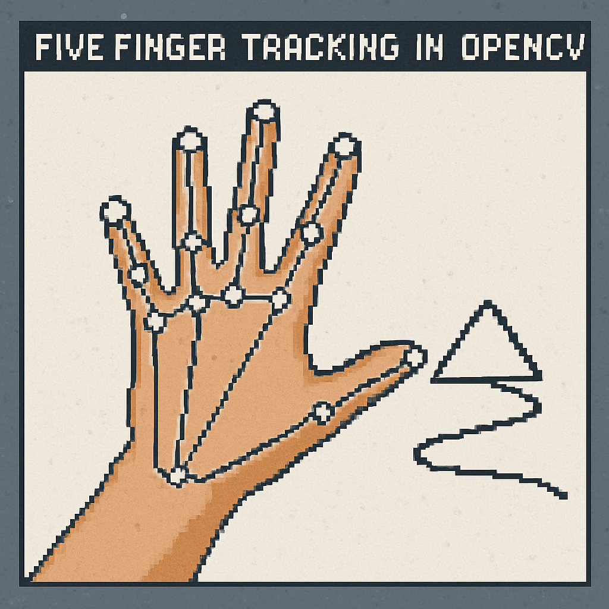

# Hand Draw Image

A Python script that transforms sketches into digital images using DALL-E 3.



## Instructions

1. **Clone the repository**:
   ```bash
   git clone https://github.com/rubenweijers/hand_draw_image.git

2. **Install requirements:**:
   ```bash
    pip install -r requirements.txt

3. **Run the script:**:
   ```bash
   python draw_to_ai.py

## Control the drawing:
- Pinch your left index and thumb to toggle drawing on and off.
- Draw with your right index finger
- Press "s" to save the drawing.
- The AI will automatically transform the image and save it to the images/ai_generated folder.
